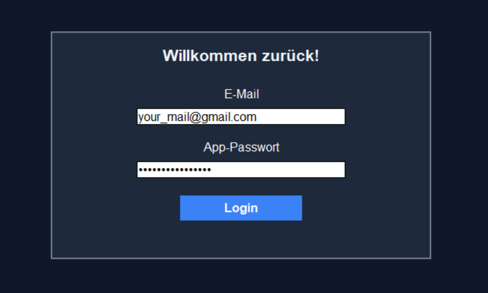
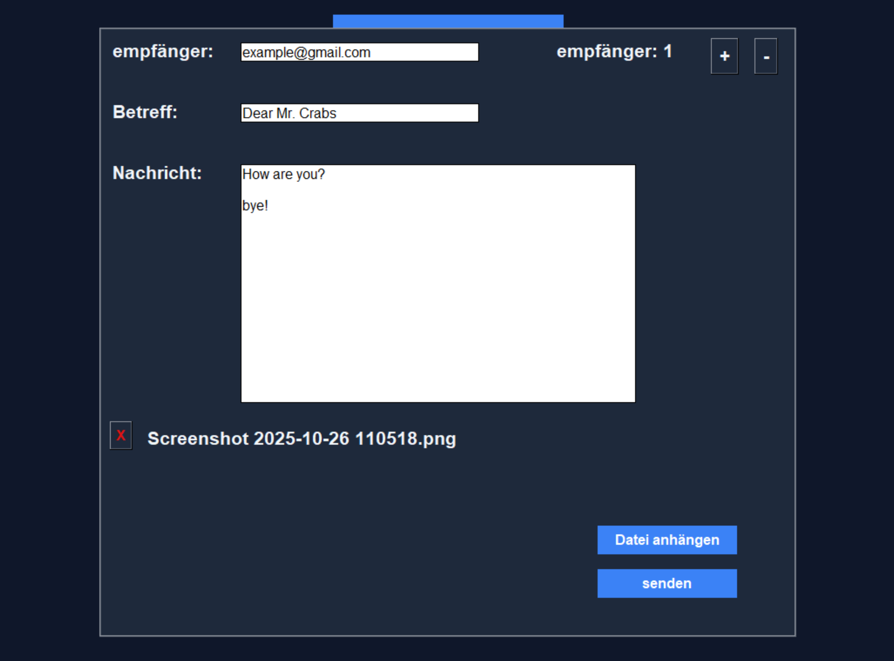

# Mail App
A simple Python Tkinter app for sending emails via SMTP with a clean and easy-to-use interface.

## Login Frame

1. **Enter your email address** – for example, Gmail.  
2. **Enable two-factor authentication** in your email account, then **generate an app password**.  
3. **Enter your email and the app password** to log in.

For example:

## Send mail

